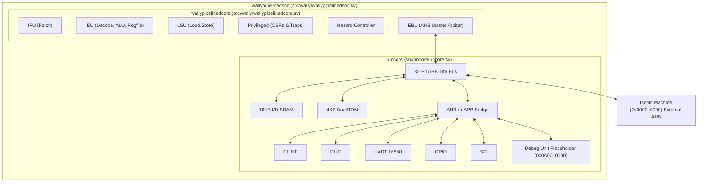
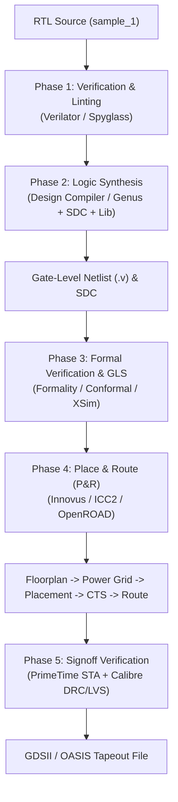

# CORE-V-Wally Minimal 32-Bit RISC-V Core & SoC (1tops_soc)
## Complete RTL Source Package & RTL-to-GDSII ASIC Implementation Guide

This directory (`1tops_soc`) contains the complete, self-contained SystemVerilog RTL source code for the `1tops_soc` CORE-V-Wally RISC-V SoC architecture.

---

## Table of Contents
1. [Directory Contents & File Inventory](#1-directory-contents--file-inventory)
2. [Hardware Specifications](#2-hardware-specifications)
3. [Architecture Overview & RTL Hierarchy](#3-architecture-overview--rtl-hierarchy)
4. [Tsetlin Machine Accelerator & Debug Unit Integration](#4-tsetlin-machine-accelerator--debug-unit-integration)
5. [Complete RTL-to-GDSII ASIC Flow Guide](#5-complete-rtl-to-gdsii-asic-flow-guide)
   - [Phase 1: RTL Functional Verification & Linting](#phase-1-rtl-functional-verification--linting)
   - [Phase 2: Logic Synthesis (RTL → Gate-Level Netlist)](#phase-2-logic-synthesis-rtl--gate-level-netlist)
   - [Phase 3: Gate-Level Simulation (GLS) & Formal Verification](#phase-3-gate-level-simulation-gls--formal-verification)
   - [Phase 4: Physical Design & Place and Route (P&R → GDSII)](#phase-4-physical-design--place-and-route-pr--gdsii)
   - [Phase 5: Signoff STA, DRC/LVS, and Tapeout](#phase-5-signoff-sta-drclvs-and-tapeout)
6. [EDA Tool Commands & Quick Reference](#6-eda-tool-commands--quick-reference)

---

## 1. Directory Contents & File Inventory

```text
1tops_soc/
├── filelist.f            # Master synthesis/simulation filelist manifest
├── README.md             # Technical documentation & ASIC implementation guide
├── config/               # Top-level SystemVerilog configuration header files
│   ├── config.vh         # 1tops_soc parameter configuration (XLEN=32, RV32I bare-metal)
│   └── ...
└── src/                  # Complete SystemVerilog RTL source tree
    ├── wally/            # Top-level SoC (wallypipelinedsoc.sv) & Core
    ├── uncore/           # AHB/APB bus, RAM, ROM, CLINT, PLIC, UART, GPIO, SPI
    └── ...               # Core logic (IFU, IEU, LSU, etc.)
```

---

## 2. Hardware Specifications

| Parameter | Setting | Description |
| :--- | :--- | :--- |
| **ISA Base** | `RV32I` | 32-Bit RISC-V Base Integer Instruction Set |
| **Privilege Mode** | `Machine` | Bare-metal execution (No U-mode or S-mode) |
| **Instruction SRAM**| `16 KB` | Mapped at `0x8000_0000` |
| **Data SRAM** | `16 KB` | Mapped at `0x8000_0000` |
| **Boot ROM** | `4 KB` | Mapped at `0x0000_1000` |
| **CLINT (Timer)** | `0x0200_0000` | Core Local Interruptor (Software & Timer interrupts) |
| **PLIC (External)** | `0x0C00_0000` | Platform-Level Interrupt Controller |
| **UART 16550** | `0x1000_0000` | 16550D UART |
| **GPIO** | `0x1000_2000` | 32-bit General Purpose I/O peripheral |
| **SPI** | `0x1004_0000` | Serial Peripheral Interface controller |
| **Debug Unit** | `0x0A00_0000` | Placeholder for Custom Debug Unit (APB Slot 5) |
| **Tsetlin Machine**| `0x3000_0000` | External AHB mapping for Convolutional Tsetlin Machine |

---

## 3. Architecture Overview & RTL Hierarchy



---

## 4. Tsetlin Machine Accelerator & Debug Unit Integration

### Tsetlin Machine Integration
The system is explicitly designed to act as a bare-metal controller for an external Convolutional Tsetlin Machine.
The accelerator space is mapped to `0x3000_0000` - `0x30FF_FFFF` (16MB).
Because it uses the `EXT_MEM` parameter configuration, any memory access by the core to this region is automatically routed out of the top-level `wallypipelinedsoc.sv` module via the `HSELEXT` and `HRDATAEXT` pins.
You simply instantiate your Tsetlin Machine alongside `wallypipelinedsoc` and connect it to these exported AHB signals. No core modifications are required!

### Debug Unit Integration
The `SDC` APB peripheral slot has been repurposed as a placeholder for a custom Debug Unit.
In `src/uncore/uncore.sv`, look for the `debug_unit` block. You can connect your custom debug module directly to the APB bus signals `PSEL[5]`, `PADDR`, `PWDATA`, and `PRDATA[5]` located there.

---

## 5. Complete RTL-to-GDSII ASIC Flow Guide

Below is the industrial implementation workflow for converting `sample_1` into silicon tapeout files (`GDSII` / `OASIS`).



---

### Phase 1: RTL Functional Verification & Linting

1. **RTL Linting**:
   ```bash
   verilator --lint-only -Iconfig -Isrc -f filelist.f --top-module wallypipelinedsoc
   ```
2. **Functional Simulation**:
   ```bash
   wsim my_minimal_rv32 tests/custom/my_baremetal_test/accel_test.elf --sim verilator
   ```

---

### Phase 2: Logic Synthesis (RTL → Gate-Level Netlist)

Synthesis translates SystemVerilog code into standard cell gates using process technology target libraries (`.lib`).

#### 1. Create Timing Constraints (`wally.sdc`)

Create `wally.sdc` to specify target clock period (e.g. 200 MHz = 5.0 ns period):

```tcl
# wally.sdc - Synopsys Design Constraints
create_clock -name clk -period 5.0 [get_ports clk]
set_clock_uncertainty 0.2 [get_clocks clk]
set_input_delay 1.0 -clock clk [all_inputs]
set_output_delay 1.0 -clock clk [all_outputs]
set_load 0.05 [all_outputs]
```

#### 2. Run Synthesis with Synopsys Design Compiler (`dc_shell`)

Execute the TCL synthesis script `synth.tcl`:

```tcl
# synth.tcl - Design Compiler Synthesis Script
set target_library "tsmc28nm_rvt_tt1v25c.lib"
set link_library "* tsmc28nm_rvt_tt1v25c.lib"

analyze -format sverilog -vcs "-Iconfig -Isrc" {src/cvw.sv src/wally/wallypipelinedsoc.sv}
elaborate wallypipelinedsoc
read_sdc wally.sdc

compile_ultra -gate_clock

write -format verilog -hierarchy -output wally_netlist.v
write_sdc wally_mapped.sdc
report_area > area_report.txt
report_timing > timing_report.txt
report_power > power_report.txt
```

Execution command:
```bash
dc_shell -f synth.tcl
```

---

### Phase 3: Gate-Level Simulation (GLS) & Formal Verification

1. **Equivalence Checking (Formal Verification)**:
   Mathematically verify that `wally_netlist.v` matches `sample_1`:
   ```bash
   fm_shell -f equivalence_check.tcl
   ```
2. **Gate-Level Simulation with SDF Timing**:
   Simulate the synthesized netlist with annotated gate delays:
   ```bash
   vsim -c -do "vlog wally_netlist.v; vsim -sdfmax /tb/dut=wally.sdf testbench; run -all"
   ```

---

### Phase 4: Physical Design & Place and Route (P&R → GDSII)

Physical Design maps logic gates onto physical silicon coordinates using Cadence Innovus or Synopsys ICC2.

```tcl
# innovus.tcl - Cadence Innovus Place & Route Command Sequence
# 1. Import Netlist & Technology LEF Files
importDesign -netlist wally_netlist.v -top wallypipelinedsoc -lef {tech.lef stdcells.lef}

# 2. Floorplanning & Power Mesh Generation
floorPlan -r 1.0 0.70 20 20 20 20   # 70% core utilization ratio
addRing -nets {VDD VSS} -width 2 -spacing 1 -layer {metal4 metal5}

# 3. Standard Cell Placement
place_opt_design

# 4. Clock Tree Synthesis (CTS)
ccopt_design

# 5. Signal Routing & Filler Insertion
routeDesign
addFiller -cell {FILL1 FILL2 FILL4}

# 6. Stream Out GDSII Layout File
streamOut wallypipelinedsoc.gds -mapFile gds2.map
```

---

### Phase 5: Signoff STA, DRC/LVS, and Tapeout

1. **Signoff Static Timing Analysis (STA)** with Synopsys PrimeTime:
   ```bash
   pt_shell -f primetime_sta.tcl
   ```
2. **DRC/LVS Physical Verification** with Siemens Calibre:
   ```bash
   calibre -drc -hier wally_drc.rules wallypipelinedsoc.gds
   calibre -lvs -hier wally_lvs.rules wallypipelinedsoc.gds
   ```
3. **Tapeout**: Transfer final `wallypipelinedsoc.gds` to the foundry for physical mask fabrication.

---

## 6. EDA Tool Commands & Quick Reference

| Implementation Phase | Primary EDA Tool | Command |
| :--- | :--- | :--- |
| **Lint Analysis** | Verilator | `verilator --lint-only -Iconfig -Isrc -f filelist.f` |
| **RTL Simulation** | Verilator / wsim | `wsim my_minimal_rv32 my_test.elf --sim verilator` |
| **Logic Synthesis** | Synopsys Design Compiler | `dc_shell -f synth.tcl` |
| **Formal Equivalence**| Synopsys Formality | `fm_shell -f formal.tcl` |
| **Place & Route** | Cadence Innovus | `innovus -files innovus.tcl` |
| **Signoff STA** | Synopsys PrimeTime | `pt_shell -f sta.tcl` |
| **DRC / LVS** | Siemens Calibre | `calibre -drc -hier wally.gds` |
