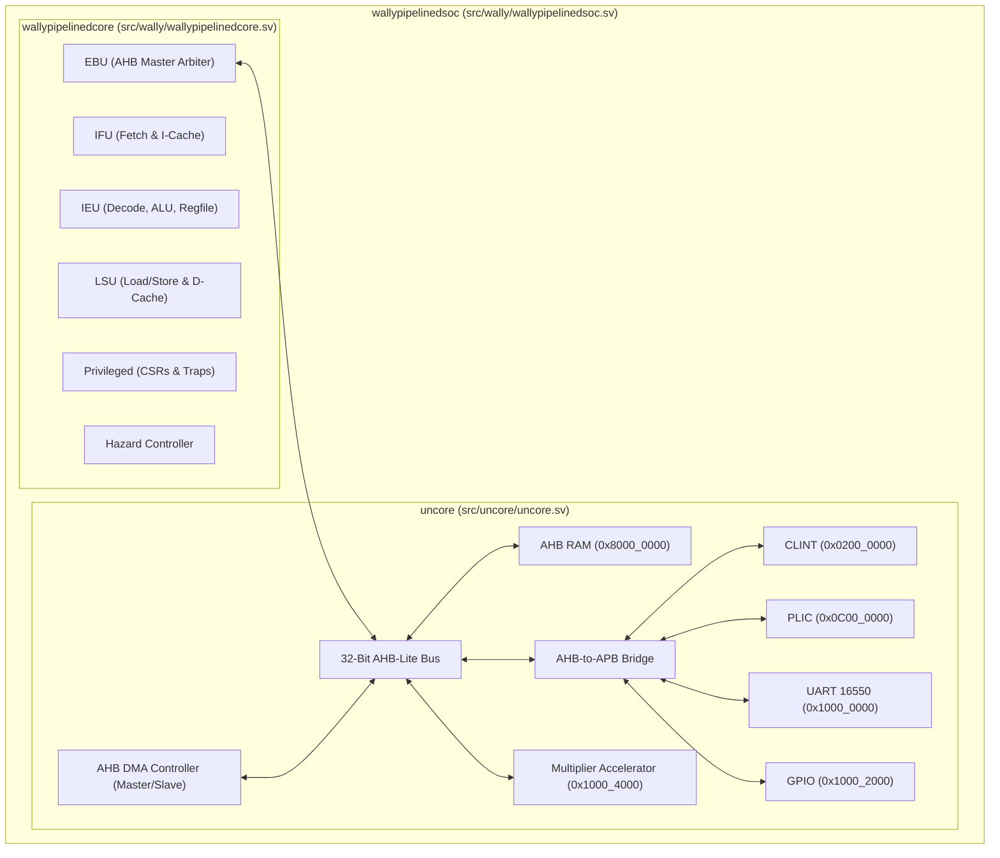
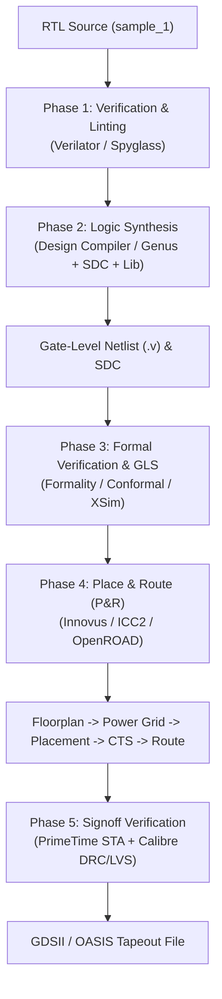

# CORE-V-Wally Minimal 32-Bit RISC-V Core & SoC
## Complete RTL Source Package & RTL-to-GDSII ASIC Implementation Guide

This directory (`sample_1`) contains the complete, self-contained SystemVerilog RTL source code for the `my_minimal_rv32` CORE-V-Wally RISC-V SoC architecture.

---

## Table of Contents
1. [Directory Contents & File Inventory](#1-directory-contents--file-inventory)
2. [Hardware Specifications (`my_minimal_rv32`)](#2-hardware-specifications-my_minimal_rv32)
3. [Architecture Overview & RTL Hierarchy](#3-architecture-overview--rtl-hierarchy)
4. [Hardware Accelerator Design & Integration Guide](#4-hardware-accelerator-design--integration-guide)
   - [4.1 Example: 32-Bit Hardware Multiplier Accelerator (`multiplier_accel_ahb.sv`)](#41-example-32-bit-hardware-multiplier-accelerator-multiplier_accel_ahbsv)
   - [4.2 Register Map & Control Logic](#42-register-map--control-logic)
   - [4.3 Instantiating the Accelerator in `uncore.sv`](#43-instantiating-the-accelerator-in-uncoresv)
   - [4.4 Bare-Metal C Software Driver & Verification (`accel_test.c`)](#44-bare-metal-c-software-driver--verification-accel_testc)
   - [4.5 Adding a General-Purpose AHB DMA Controller](#45-adding-a-general-purpose-ahb-dma-controller)
5. [Complete RTL-to-GDSII ASIC Flow Guide](#5-complete-rtl-to-gdsii-asic-flow-guide)
   - [Phase 1: RTL Functional Verification & Linting](#phase-1-rtl-functional-verification--linting)
   - [Phase 2: Logic Synthesis (RTL → Gate-Level Netlist)](#phase-2-logic-synthesis-rtl--gate-level-netlist)
   - [Phase 3: Gate-Level Simulation (GLS) & Formal Verification](#phase-3-gate-level-simulation-gls--formal-verification)
   - [Phase 4: Physical Design & Place and Route (P&R → GDSII)](#phase-4-physical-design--place-and-route-pr--gdsii)
   - [Phase 5: Signoff STA, DRC/LVS, and Tapeout](#phase-5-signoff-sta-drclvs-and-tapeout)
6. [EDA Tool Commands & Quick Reference](#6-eda-tool-commands--quick-reference)

---

## 1. Directory Contents & File Inventory

```text
sample_1/
├── filelist.f            # Master synthesis/simulation filelist manifest (232 files total)
├── README.md             # Technical documentation & ASIC implementation guide
├── config/               # Top-level SystemVerilog configuration header files
│   ├── config.vh         # my_minimal_rv32 parameter configuration (XLEN=32, AHB Bus, RAM)
│   ├── config-shared.vh  # Shared RISC-V constants, mode encodings, and CSR definitions
│   ├── parameter-defs.vh # Struct definitions and helper macros
│   └── BranchPredictorType.vh # Branch predictor type encodings
└── src/                  # Complete SystemVerilog RTL source tree
    ├── cvw.sv            # Top-level package & cvw_t parameter struct definition
    ├── wally/            # Top-level SoC (wallypipelinedsoc.sv) & Core (wallypipelinedcore.sv)
    ├── uncore/           # AHB/APB bus, RAM, ROM, CLINT, PLIC, UART 16550, GPIO, SPI, Accelerators
    │   └── multiplier_accel_ahb.sv  # 32-Bit Hardware Multiplier Accelerator module
    ├── ifu/              # Instruction Fetch Unit & Branch Predictor
    ├── ieu/              # Integer Execution Unit (ALU, Register File, Control)
    ├── lsu/              # Load/Store Unit & Caches
    ├── fpu/              # Floating Point Unit (Disabled in minimal config)
    ├── privileged/       # CSRs, Trap Unit, Privilege Modes (Machine/User)
    ├── hazard/           # Pipeline Stall & Flush Controller
    ├── mdu/              # Multiply/Divide Unit (Disabled in minimal config)
    ├── ebu/              # External Bus Unit (AHB Arbiter)
    ├── cache/            # Shared Cache Infrastructure (I-Cache / D-Cache)
    ├── mmu/              # Memory Management Unit & PMP/PMA Checkers
    └── generic/          # Generic SRAM/RAM/ROM Hardware Primitives
```

---

## 2. Hardware Specifications (`my_minimal_rv32`)

| Parameter | Setting | Description |
| :--- | :--- | :--- |
| **ISA Base** | `RV32I` | 32-Bit RISC-V Base Integer Instruction Set |
| **Extensions** | `Zicsr`, `Zicntr` | CSR Access & Performance Counters enabled |
| **Datapath Width** | `XLEN = 32` | 32-bit registers, 32-bit ALU, 32-bit memory addresses |
| **System Bus** | `AHB-Lite 32-Bit` | High-performance 32-bit system bus with AHB-to-APB bridge |
| **Instruction Cache** | `1 KB` | Direct-mapped I-Cache (`ICACHE_NUMWAYS = 1`) |
| **Data Cache** | `1 KB` | Direct-mapped D-Cache (`DCACHE_NUMWAYS = 1`) |
| **RAM Space** | `0x8000_0000` | 32-Bit AHB RAM module mapped at `0x8000_0000` |
| **CLINT (Timer)** | `0x0200_0000` | Core Local Interruptor (Software & Timer interrupts) |
| **PLIC (External)** | `0x0C00_0000` | Platform-Level Interrupt Controller (Peripheral interrupts) |
| **UART 16550** | `0x1000_0000` | 16550D UART with internal 16-byte FIFOs & DMA mode signals |
| **GPIO** | `0x1000_2000` | 32-bit General Purpose I/O peripheral |
| **SPI** | `0x1000_3000` | Serial Peripheral Interface controller |
| **Accelerator MMIO** | `0x1000_4000` | Hardware Multiplier Accelerator MMIO Range (`0x1000_4000` - `0x1000_4FFF`) |

---

## 3. Architecture Overview & RTL Hierarchy



---

## 4. Hardware Accelerator Design & Integration Guide

### 4.1 Example: 32-Bit Hardware Multiplier Accelerator (`multiplier_accel_ahb.sv`)

A complete 32-bit hardware multiplier accelerator module is included in `src/uncore/multiplier_accel_ahb.sv`. It connects as an AHB-Lite slave to perform high-speed 32x32 hardware multiplication.

### 4.2 Register Map & Control Logic

Memory-mapped registers at MMIO base `0x1000_4000`:

| Register Offset | Register Name | Access | Function |
| :--- | :--- | :--- | :--- |
| `0x00` | `SRC_A` | R/W | 32-bit Multiplicand input operand |
| `0x04` | `SRC_B` | R/W | 32-bit Multiplier input operand |
| `0x08` | `CTRL` | R/W | Bit 0: Start computation, Bit 2: IRQ Enable |
| `0x0C` | `STATUS` | R | Bit 0: Done bit (Asserts 1 when result is valid) |
| `0x10` | `RESULT_LO` | R | Lower 32 bits of 64-bit product (`SRC_A * SRC_B`) |
| `0x14` | `RESULT_HI` | R | Upper 32 bits of 64-bit product (`SRC_A * SRC_B`) |

#### SystemVerilog Module Code (`src/uncore/multiplier_accel_ahb.sv`)

```systemverilog
module multiplier_accel_ahb (
    input  logic        HCLK, HRESETn, HSEL,
    input  logic [31:0] HADDR, HWDATA,
    input  logic        HWRITE,
    input  logic [1:0]  HTRANS,
    input  logic        HREADY,
    output logic [31:0] HRDATA,
    output logic        HREADYOUT,
    output logic [1:0]  HRESP,
    output logic        accel_irq
);

    logic [31:0] src_a, src_b, ctrl_reg, status_reg;
    logic [63:0] product_reg;
    logic        write_phase;
    logic [31:0] addr_phase;

    assign HREADYOUT = 1'b1;  // Zero wait-state assertion
    assign HRESP     = 2'b00; // OKAY response

    // AHB Address & Control Phase Latch
    always_ff @(posedge HCLK or negedge HRESETn) begin
        if (!HRESETn) begin
            write_phase <= 1'b0;
            addr_phase  <= 32'h0;
        end else if (HREADY & HSEL & HTRANS[1]) begin
            write_phase <= HWRITE;
            addr_phase  <= HADDR;
        end else begin
            write_phase <= 1'b0;
        end
    end

    // AHB Write Operations (Data Phase)
    always_ff @(posedge HCLK or negedge HRESETn) begin
        if (!HRESETn) begin
            src_a <= 32'h0; src_b <= 32'h0; ctrl_reg <= 32'h0;
        end else if (write_phase) begin
            case (addr_phase[4:0])
                5'h00: src_a    <= HWDATA;
                5'h04: src_b    <= HWDATA;
                5'h08: ctrl_reg <= HWDATA;
            endcase
        end
    end

    // Hardware Multiplier Engine Computation
    always_ff @(posedge HCLK or negedge HRESETn) begin
        if (!HRESETn) begin
            product_reg <= 64'h0; status_reg <= 32'h0; accel_irq <= 1'b0;
        end else if (ctrl_reg[0]) begin
            product_reg <= 64'(src_a) * 64'(src_b); // Hardware multiplication
            status_reg  <= 32'h1;                  // Set Done bit
            accel_irq   <= ctrl_reg[2];            // Assert IRQ if enabled
        end
    end

    // AHB Read Operations
    always_comb begin
        case (addr_phase[4:0])
            5'h00: HRDATA = src_a;
            5'h04: HRDATA = src_b;
            5'h08: HRDATA = ctrl_reg;
            5'h0C: HRDATA = status_reg;
            5'h10: HRDATA = product_reg[31:0];  // RESULT_LO
            5'h14: HRDATA = product_reg[63:32]; // RESULT_HI
            default: HRDATA = 32'h0;
        endcase
    end
endmodule
```

---

### 4.3 Instantiating the Accelerator in `uncore.sv`

In `src/uncore/uncore.sv`:

```systemverilog
// 1. Address Decode Logic at 0x1000_4000
logic HSEL_ACCEL;
assign HSEL_ACCEL = (HADDR[31:12] == 20'h10004);

// 2. Module Instance
multiplier_accel_ahb accel (
    .HCLK(HCLK),
    .HRESETn(HRESETn),
    .HSEL(HSEL_ACCEL),
    .HADDR(HADDR),
    .HWDATA(HWDATA),
    .HWRITE(HWRITE),
    .HTRANS(HTRANS),
    .HREADY(HREADY),
    .HRDATA(HRDATA_ACCEL),
    .HREADYOUT(HREADYOUT_ACCEL),
    .HRESP(),
    .accel_irq(accel_interrupt)
);
```

---

### 4.4 Bare-Metal C Software Driver & Verification (`accel_test.c`)

The complete C software driver and test application is located in `tests/custom/my_baremetal_test/accel_test.c`:

```c
#define UART_BASE         0x10000000
#define GPIO_BASE         0x10002000
#define ACCEL_BASE        0x10004000

#define ACCEL_SRC_A       (*(volatile unsigned int *)(ACCEL_BASE + 0x00))
#define ACCEL_SRC_B       (*(volatile unsigned int *)(ACCEL_BASE + 0x04))
#define ACCEL_CTRL        (*(volatile unsigned int *)(ACCEL_BASE + 0x08))
#define ACCEL_STATUS      (*(volatile unsigned int *)(ACCEL_BASE + 0x0C))
#define ACCEL_RESULT_LO   (*(volatile unsigned int *)(ACCEL_BASE + 0x10))
#define ACCEL_RESULT_HI   (*(volatile unsigned int *)(ACCEL_BASE + 0x14))

unsigned int run_hardware_multiplier(unsigned int a, unsigned int b, unsigned int *result_hi) {
    // 1. Write input operands A and B
    ACCEL_SRC_A = a;
    ACCEL_SRC_B = b;

    // 2. Start hardware execution (Bit 0 = 1)
    ACCEL_CTRL = 0x1;

    // 3. Poll status register until Done bit (Bit 0) is set
    while ((ACCEL_STATUS & 0x1) == 0);

    // 4. Read result
    *result_hi = ACCEL_RESULT_HI;
    return ACCEL_RESULT_LO;
}

void main() {
    volatile unsigned int *gpio = (unsigned int *)GPIO_BASE;
    unsigned int res_hi = 0;

    // Test 1: 1234 * 5678 = 7006652
    unsigned int res_lo = run_hardware_multiplier(1234, 5678, &res_hi);
    if (res_lo == 7006652 && res_hi == 0) {
        *gpio = 0x1; // Assert GPIO Success Signal
    }

    while (1);
}
```

#### How to Compile & Test in Simulation:

```bash
cd $WALLY/tests/custom/my_baremetal_test

# 1. Compile C application into 32-bit ELF
riscv64-unknown-elf-gcc -march=rv32i -mabi=ilp32 \
  -static -mcmodel=medany -fvisibility=hidden -nostdlib -nostartfiles \
  -T linker_rv32.ld start.S accel_test.c -o accel_test.elf

# 2. Convert ELF to verilog memfile
elf2hex accel_test.elf accel_test.elf.memfile

# 3. Run Verilator simulation
cd $WALLY
wsim my_minimal_rv32 $WALLY/tests/custom/my_baremetal_test/accel_test.elf --sim verilator
```

---

### 4.5 Adding a General-Purpose AHB DMA Controller

A DMA Controller operates as a **dual-interface block**:
1. **AHB Slave Interface**: CPU programs MMIO registers (`SRC_ADDR`, `DST_ADDR`, `LEN`, `CONTROL`) at MMIO base `0x1000_5000`.
2. **AHB Master Interface**: DMA engine acquires bus mastership from the AHB arbiter (`ebu.sv`), autonomously reading from source memory and writing to target destination without CPU intervention.

```systemverilog
// src/uncore/my_dma_controller_ahb.sv
// Dual-Interface AHB-Lite DMA Controller (Slave Config + Master Transfer)

module my_dma_controller_ahb (
    input  logic        HCLK, HRESETn,
    // AHB Slave Interface (CPU Config at 0x1000_5000)
    input  logic        HSEL_S,
    input  logic [31:0] HADDR_S, HWDATA_S,
    input  logic        HWRITE_S, HREADY_S,
    input  logic [1:0]  HTRANS_S,
    output logic [31:0] HRDATA_S,
    output logic        HREADYOUT_S,
    // AHB Master Interface (Autonomous Bus Transfer)
    output logic        HBUSREQ_M,
    input  logic        HGRANT_M,
    output logic [31:0] HADDR_M, HWDATA_M,
    output logic        HWRITE_M,
    output logic [1:0]  HTRANS_M,
    input  logic [31:0] HRDATA_M, HREADY_M,
    output logic        dma_irq
);
    // Control registers and Master FSM implementation...
endmodule
```

---

## 5. Complete RTL-to-GDSII ASIC Flow Guide

Below is the industrial implementation workflow for converting `sample_1` into silicon tapeout files (`GDSII` / `OASIS`).



---

### Phase 1: RTL Functional Verification & Linting

1. **RTL Linting**:
   ```bash
   verilator --lint-only -Iconfig -Isrc -f filelist.f --top-module wallypipelinedsoc
   ```
2. **Functional Simulation**:
   ```bash
   wsim my_minimal_rv32 tests/custom/my_baremetal_test/accel_test.elf --sim verilator
   ```

---

### Phase 2: Logic Synthesis (RTL → Gate-Level Netlist)

Synthesis translates SystemVerilog code into standard cell gates using process technology target libraries (`.lib`).

#### 1. Create Timing Constraints (`wally.sdc`)

Create `wally.sdc` to specify target clock period (e.g. 200 MHz = 5.0 ns period):

```tcl
# wally.sdc - Synopsys Design Constraints
create_clock -name clk -period 5.0 [get_ports clk]
set_clock_uncertainty 0.2 [get_clocks clk]
set_input_delay 1.0 -clock clk [all_inputs]
set_output_delay 1.0 -clock clk [all_outputs]
set_load 0.05 [all_outputs]
```

#### 2. Run Synthesis with Synopsys Design Compiler (`dc_shell`)

Execute the TCL synthesis script `synth.tcl`:

```tcl
# synth.tcl - Design Compiler Synthesis Script
set target_library "tsmc28nm_rvt_tt1v25c.lib"
set link_library "* tsmc28nm_rvt_tt1v25c.lib"

analyze -format sverilog -vcs "-Iconfig -Isrc" {src/cvw.sv src/wally/wallypipelinedsoc.sv}
elaborate wallypipelinedsoc
read_sdc wally.sdc

compile_ultra -gate_clock

write -format verilog -hierarchy -output wally_netlist.v
write_sdc wally_mapped.sdc
report_area > area_report.txt
report_timing > timing_report.txt
report_power > power_report.txt
```

Execution command:
```bash
dc_shell -f synth.tcl
```

---

### Phase 3: Gate-Level Simulation (GLS) & Formal Verification

1. **Equivalence Checking (Formal Verification)**:
   Mathematically verify that `wally_netlist.v` matches `sample_1`:
   ```bash
   fm_shell -f equivalence_check.tcl
   ```
2. **Gate-Level Simulation with SDF Timing**:
   Simulate the synthesized netlist with annotated gate delays:
   ```bash
   vsim -c -do "vlog wally_netlist.v; vsim -sdfmax /tb/dut=wally.sdf testbench; run -all"
   ```

---

### Phase 4: Physical Design & Place and Route (P&R → GDSII)

Physical Design maps logic gates onto physical silicon coordinates using Cadence Innovus or Synopsys ICC2.

```tcl
# innovus.tcl - Cadence Innovus Place & Route Command Sequence
# 1. Import Netlist & Technology LEF Files
importDesign -netlist wally_netlist.v -top wallypipelinedsoc -lef {tech.lef stdcells.lef}

# 2. Floorplanning & Power Mesh Generation
floorPlan -r 1.0 0.70 20 20 20 20   # 70% core utilization ratio
addRing -nets {VDD VSS} -width 2 -spacing 1 -layer {metal4 metal5}

# 3. Standard Cell Placement
place_opt_design

# 4. Clock Tree Synthesis (CTS)
ccopt_design

# 5. Signal Routing & Filler Insertion
routeDesign
addFiller -cell {FILL1 FILL2 FILL4}

# 6. Stream Out GDSII Layout File
streamOut wallypipelinedsoc.gds -mapFile gds2.map
```

---

### Phase 5: Signoff STA, DRC/LVS, and Tapeout

1. **Signoff Static Timing Analysis (STA)** with Synopsys PrimeTime:
   ```bash
   pt_shell -f primetime_sta.tcl
   ```
2. **DRC/LVS Physical Verification** with Siemens Calibre:
   ```bash
   calibre -drc -hier wally_drc.rules wallypipelinedsoc.gds
   calibre -lvs -hier wally_lvs.rules wallypipelinedsoc.gds
   ```
3. **Tapeout**: Transfer final `wallypipelinedsoc.gds` to the foundry for physical mask fabrication.

---

## 6. EDA Tool Commands & Quick Reference

| Implementation Phase | Primary EDA Tool | Command |
| :--- | :--- | :--- |
| **Lint Analysis** | Verilator | `verilator --lint-only -Iconfig -Isrc -f filelist.f` |
| **RTL Simulation** | Verilator / wsim | `wsim my_minimal_rv32 my_test.elf --sim verilator` |
| **Logic Synthesis** | Synopsys Design Compiler | `dc_shell -f synth.tcl` |
| **Formal Equivalence**| Synopsys Formality | `fm_shell -f formal.tcl` |
| **Place & Route** | Cadence Innovus | `innovus -files innovus.tcl` |
| **Signoff STA** | Synopsys PrimeTime | `pt_shell -f sta.tcl` |
| **DRC / LVS** | Siemens Calibre | `calibre -drc -hier wally.gds` |
