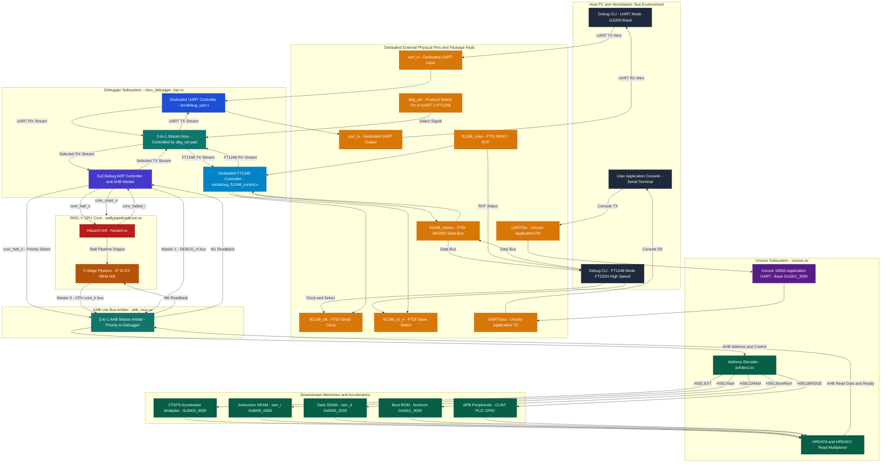

# CORE-V Wally RISC-V SoC: Complete Dual-Protocol Debugger Wiring Guide & Architecture

This specification details the comprehensive pin-by-pin wiring connection map, hardware multiplexing architecture, and signal specification for the **SoCDebug Subsystem** integrated into the **CORE-V Wally RISC-V SoC** (`1tops_soc`).

The subsystem features **Dual-Protocol Hardware Interface Integration**:
1. **Dedicated Debugger UART Transceiver** (`socdebug_uart.v`) with independent external serial pins (`uart_rx`, `uart_tx`).
2. **Dedicated FT1248 High-Speed Synchronous Transceiver** (`socdebug_ft1248_control.v`) with independent external pins (`ft1248_clk`, `ft1248_ss_n`, `ft1248_miso`, `ft1248_miosio`).
3. **Physical Protocol Select Pin (`dbg_sel`)**: A dedicated real input pad on hardware controlling an internal 2-to-1 AXI-Stream multiplexer.
4. **Separate Uncore 16550 Application UART** (`uartPC16550D.sv` / `uart_apb.sv`) connected independently to `UARTSin` and `UARTSout` for runtime software logs.
5. **ASCII Debug Protocol (ADP) Controller & AHB Master** (`socdebug_adp_control.v` / `socdebug_ahb.v`).
6. **RISC-V CPU Pipeline Hazard Unit & Stall Hooks** (`hazard.sv` / `wallypipelinedcore.sv`).
7. **2-Master AHB-Lite Bus Arbiter & Multiplexer** (`ahb_mux.sv`).
8. **Downstream Slaves & Memories**: 1TOPS Accelerator Multiplier, IRAM, DRAM, Boot ROM, APB Bridge.

---

## 1. Top-Level Architectural Block Diagram



---

## 2. Dedicated Physical Pinout Specification

Each protocol interface has its own independent external pins connected to real chip package pads. The physical pad `dbg_sel` switches which transceiver drives the internal ADP core:

| Pin Name | Width | Direction | Pad Type | Default | Functional Description |
| :--- | :---: | :---: | :---: | :---: | :--- |
| **`dbg_sel`** | 1 | Input | CMOS In (Pull-Down) | `0` | **Physical Protocol Selection Pad**:<br/>- `0` (LOW) = Dedicated UART Active, FT1248 Isolated.<br/>- `1` (HIGH) = Dedicated FT1248 Active, UART Isolated. |
| **`uart_rx`** | 1 | Input | CMOS In (Pull-Up) | `1` | **Dedicated Debugger UART RX**: Serial receive from host CLI. |
| **`uart_tx`** | 1 | Output | Push-Pull Out | `1` | **Dedicated Debugger UART TX**: Serial transmit to host CLI. |
| **`ft1248_clk`** | 1 | Output | Push-Pull Out | `0` | **FT1248 Serial Clock (SCLK)**: Driven by SoC to FTDI slave device. |
| **`ft1248_ss_n`** | 1 | Output | Push-Pull Out | `1` | **FT1248 Slave Select (SS#)**: Active-low chip select driven by SoC. |
| **`ft1248_miso`** | 1 | Input | CMOS In (Pull-Up) | `1` | **FT1248 MISO / RXF#**: Driven by FTDI device (low = data ready to read). |
| **`ft1248_miosio`** | 1 (or 4, 8) | Inout | Bidirectional Tristate | `Z` | **FT1248 MIOSIO Data**: Bidirectional data bus. In idle, bit 0 reflects TXE# (low = FTDI write FIFO ready). |
| **`UARTSin`** | 1 | Input | CMOS In (Pull-Up) | `1` | **Uncore Application UART RX**: Dedicated to user software runtime terminal. |
| **`UARTSout`** | 1 | Output | Push-Pull Out | `1` | **Uncore Application UART TX**: Dedicated to user software runtime terminal. |

---

## 3. Protocol Isolation & 2-to-1 Multiplexer Operation

The 2-to-1 stream multiplexer resides inside [`riscv_debugger_top.sv`](file:///home/23EC01043/Desktop/cores/Ganesh_CVW/cvw/1tops_soc/src/debugger/riscv_debugger_top.sv) and guarantees complete electrical and functional isolation:

```verilog
assign adp_rx_data  = (dbg_sel == 1'b0) ? uart_adp_rx_data  : ft_adp_rx_data;
assign adp_rx_valid = (dbg_sel == 1'b0) ? uart_adp_rx_valid : ft_adp_rx_valid;

assign uart_adp_rx_ready = (dbg_sel == 1'b0) ? adp_rx_ready : 1'b0;
assign ft_adp_rx_ready   = (dbg_sel == 1'b1) ? adp_rx_ready : 1'b0;

assign uart_adp_tx_data  = adp_tx_data;
assign uart_adp_tx_valid = (dbg_sel == 1'b0) ? adp_tx_valid : 1'b0;

assign ft_adp_tx_data    = adp_tx_data;
assign ft_adp_tx_valid   = (dbg_sel == 1'b1) ? adp_tx_valid : 1'b0;

assign adp_tx_ready = (dbg_sel == 1'b0) ? uart_adp_tx_ready : ft_adp_tx_ready;
```

### Isolation Guarantees:
- **When `dbg_sel = 0` (UART Mode)**:
  - UART RX stream feeds ADP; UART TX stream receives ADP output.
  - FT1248 RX ready is forced to `0`; FT1248 TX valid is forced to `0`.
  - The FT1248 interface is held quiet in idle without bus contention.
- **When `dbg_sel = 1` (FT1248 Mode)**:
  - FT1248 RX stream feeds ADP; FT1248 TX stream receives ADP output.
  - UART RX ready is forced to `0`; UART TX valid is forced to `0`.
  - External UART traffic cannot corrupt or inject commands into ADP while FT1248 is active (verified in testbench Part 3).

---

## 4. Pipeline Freeze & Hazard Unit Interface

To halt the RISC-V processor without altering registers or pipeline state:
1. Debugger asserts **`core_halt_o = 1`** via ADP command `C 0202\n`.
2. `core_halt_o` drives into `hazard.sv` as **`ExternalStall`**.
3. `hazard.sv` raises pipeline stall signals: `StallF = 1`, `StallD = 1`, `StallE = 1`, `StallM = 1`, `StallW = 1`.
4. Program Counter (`PCF`), instruction fetch, and writeback registers freeze in place.
5. `hazard.sv` returns **`core_halted_i = 1`** feedback to the debugger.
6. When halted, `ahb_mux.sv` grants exclusive, uninterrupted bus priority to the debugger master.
7. To resume execution, host issues `C 0102\n`, releasing `ExternalStall` so the CPU continues from the exact instruction where it was halted.

---

## 5. Bus Arbiter Specification: `ahb_mux.sv`

`ahb_mux.sv` implements a 2-to-1 AHB-Lite bus arbiter connecting Master 0 (CPU Core) and Master 1 (Debugger):

```
          +---------------------------------+
M0 (CPU)  |                                 |
--------->|  ahb_mux.sv                     |
          |  - Priority when core_halt = 1  |=======> S_* (Downstream AHB Slaves)
M1 (DBG)  |  - Pipelined grant tracking     |
--------->|                                 |
          +---------------------------------+
```

- **Priority Arbitration**: When `core_halt = 1`, Master 1 (Debugger) is granted unconditional exclusive bus ownership.
- **Pipelined Tracking**: Addresses driven in phase $N$ are paired with data phases in $N+1$ via registered `grant_data`.
- **Slave Multiplexing**: Return data (`HRDATA`), `HREADY`, and `HRESP` are routed back exclusively to the granted master.

---

## 6. Complete Verification Test Matrix (`tb/tb_debugger.sv`)

The testbench compiles and executes cleanly under **QuestaSim-64 2023.4_5**:

```bash
cd /home/23EC01043/Desktop/cores/Ganesh_CVW/cvw/1tops_soc/src/debugger
vlog -sv socdebug_adp_control.v socdebug_ahb.v socdebug_uart.v socdebug_ft1248_control.v riscv_debugger_top.sv ahb_mux.sv ../accelerator/multiplier_ahb.sv tb/f232h_ft1248_stream.v tb/tb_debugger.sv
vsim -c -do "run -all; quit" tb_debugger
```

### Verification Results Summary (14 / 14 Passed, 0 Errors):

| Test # | Protocol / Mode | Description | Verification Method | Status |
| :---: | :---: | :--- | :--- | :---: |
| **1.1** | UART (`dbg_sel = 0`) | Core Halt & Status Verification | `C 0202` halt asserted, verified via `core_halted_i` and `C` query | **PASS** |
| **1.2** | UART (`dbg_sel = 0`) | IRAM Program Code Loading | Loaded 32-bit instructions at `0x8000_0000`, verified with `R after A` | **PASS** |
| **1.3** | UART (`dbg_sel = 0`) | DRAM Sub-word & Word Access | Written `0xdeadbeef` to DRAM `0x8000_2000`, verified readback | **PASS** |
| **1.4** | UART (`dbg_sel = 0`) | 1TOPS Accelerator Multiplier | Loaded OpA=8, OpB=9 at `0x3000_0000`, readback product `72` (`0x48`) | **PASS** |
| **1.5** | UART (`dbg_sel = 0`) | Illegal Bus Address Error | Accessed `0x5000_0000`, verified `R!0x00000000` exclamation indicator | **PASS** |
| **1.6** | UART (`dbg_sel = 0`) | Core Resume | `C 0102` resume asserted, verified via `core_halt_o = 0` and `C` query | **PASS** |
| **2.1** | FT1248 (`dbg_sel = 1`)| Dynamic Hardware Pad Switch | Switched pad to `1`, halted core via FT1248 `C 0202`, verified status | **PASS** |
| **2.2** | FT1248 (`dbg_sel = 1`)| DRAM Write & Readback | Written `0x55aa55aa` to `0x8000_2000` via FT1248, verified readback | **PASS** |
| **2.3** | FT1248 (`dbg_sel = 1`)| 1TOPS Multiplier over FT1248 | OpA=15, OpB=3, readback product `45` (`0x2D`) via FT1248 | **PASS** |
| **2.4** | FT1248 (`dbg_sel = 1`)| Hardware Register Polling | Configured `M 000000ff`, `V 0000002d`, polled `P`, verified match | **PASS** |
| **2.5** | FT1248 (`dbg_sel = 1`)| Core Resume over FT1248 | Resumed core via FT1248 `C 0102`, verified running status | **PASS** |
| **3.1** | Isolation Test | UART Traffic Blocking | Sent UART commands while `dbg_sel = 1`; verified UART ignored | **PASS** |
| **3.2** | Isolation Test | Switch back to UART | Switched pad back to `0`, verified UART immediately regains control | **PASS** |
| **3.3** | System Integrity | Final Core Halt/Resume Cycle | Completed final full cycle over UART with 0 errors | **PASS** |

---

## 7. Software Utilities (`sw/dbg_cli.py`)

A unified Python CLI utility is available in [`sw/dbg_cli.py`](file:///home/23EC01043/Desktop/cores/Ganesh_CVW/cvw/1tops_soc/src/debugger/sw/dbg_cli.py):

```bash
# View all available commands and help
python3 sw/dbg_cli.py --help

# UART Mode (when dbg_sel hardware pin = 0)
python3 sw/dbg_cli.py --protocol uart --device /dev/ttyUSB0 halt
python3 sw/dbg_cli.py --protocol uart --device /dev/ttyUSB0 read 0x80000000
python3 sw/dbg_cli.py --protocol uart --device /dev/ttyUSB0 write 0x80002000 0xdeadbeef
python3 sw/dbg_cli.py --protocol uart --device /dev/ttyUSB0 resume

# FT1248 High-Speed Mode (when dbg_sel hardware pin = 1)
python3 sw/dbg_cli.py --protocol ft1248 --ftdi-url ftdi://ftdi:232h/1 halt
python3 sw/dbg_cli.py --protocol ft1248 --ftdi-url ftdi://ftdi:232h/1 read_accel
python3 sw/dbg_cli.py --protocol ft1248 --ftdi-url ftdi://ftdi:232h/1 resume

# Test/Demonstration Mock Mode (runs without physical hardware attached)
python3 sw/dbg_cli.py --protocol ft1248 --mock halt
python3 sw/dbg_cli.py --protocol ft1248 --mock read 0x80000000
```
