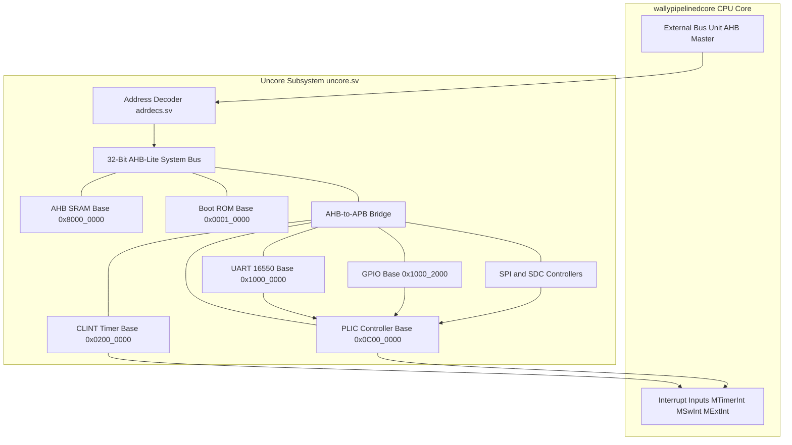
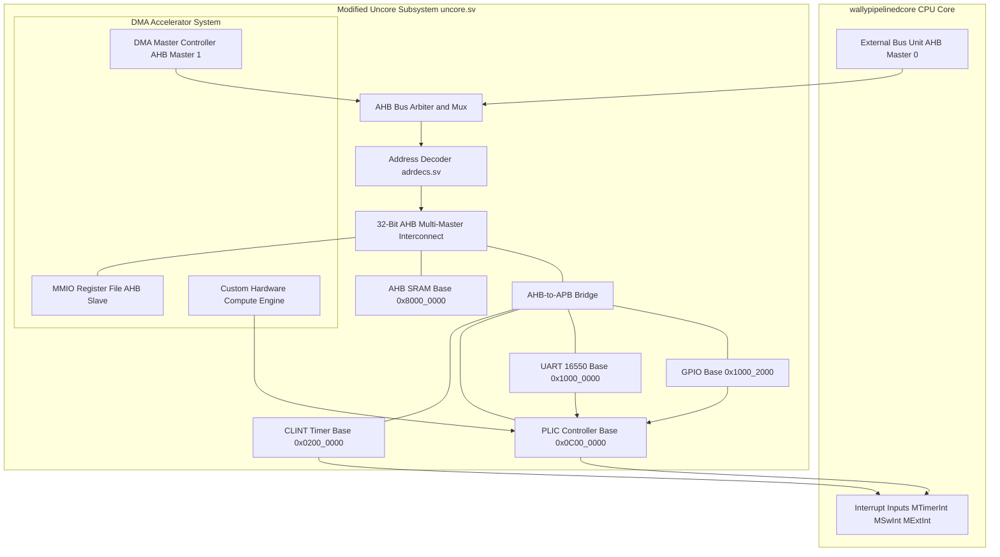

# CORE-V-Wally Uncore & DMA Accelerator Integration Architecture

This document provides a comprehensive architectural specification for the **Uncore Subsystem** of the CORE-V-Wally (`sample_1`) RISC-V System-on-Chip (SoC).

It is divided into two main sections:
1. **Original Baseline Uncore Architecture** (Before accelerator integration).
2. **Modified DMA Accelerator System Architecture** (After integrating direct SRAM access and PLIC interrupt signaling).

---

# Part 1: Original Uncore Architecture (Before Accelerator Integration)

In the default `sample_1` codebase, the Uncore subsystem handles system memory, physical address decoding, protocol conversion to peripheral buses, and timer/external interrupt routing.

## 1.1 Baseline System Topology Diagram



---

## 1.2 Detailed Breakdown of Original Architecture

### 1. Single AHB Master Operation & Bus Timing
* **Master Controller**: The CPU Core's **External Bus Unit (EBU)** ([ebu.sv](file:///home/ganesh/Desktop/cvw/sample_1/src/ebu/ebu.sv)) is the sole bus master driving memory requests.
* **Pipelined Bus Phases**:
  * **Address Phase**: The EBU drives `HADDR`, `HTRANS` (`NONSEQ` or `SEQ`), `HWRITE`, `HSIZE`, and `HBURST` on the rising clock edge.
  * **Data Phase**: During the following clock cycle, write data `HWDATA` is driven by the master (for writes) or read data `HRDATA` is returned by the slave (for reads), provided `HREADY` is asserted HIGH.
* **No Arbitration Overhead**: Because there is only one bus master, no bus request (`HBUSREQ`) or grant (`HGRANT`) signals are required. The EBU directly drives the system bus multiplexers.

### 2. Memory Space Layout & Address Decoding Mechanics (`adrdecs.sv`)
Physical addresses requested by the EBU are decoded by `adrdecs.sv` using hardcoded physical memory attribute ranges:
* **AHB SRAM (`0x8000_0000` – `0x800F_FFFF`)**: Primary high-speed system RAM. Provides single-cycle read and write operations (`HREADYOUT = 1'b1`).
* **Boot ROM (`0x0001_0000` – `0x0001_1FFF`)**: Read-only memory storing initial system boot code.
* **Peripheral Window (`0x1000_0000` – `0x1000_FFFF`)**: Address range allocated for low-speed peripherals connected through the APB bridge.
* **Delay Registers (`hseldelayreg`)**: Because AHB control signals are decoded during the Address Phase while data transfers occur in the Data Phase, `uncore.sv` uses delay registers (`hseldelayreg` and `hselbridgedelayreg`) enabled by `HREADY` to latch the active slave select line (`HSELRamD`, `HSELBRIDGED`, `HSELBootRomD`) for the Data Phase.

### 3. AHB-to-APB Peripheral Bridge (`ahbapbbridge.sv`)
Translates 32-bit AHB bus protocol accesses into 2-cycle APB bus transactions (`PCLK`, `PRESETn`, `PSEL`, `PENABLE`, `PADDR`, `PWRITE`, `PWDATA`, `PRDATA`, `PREADY`):
* **Cycle 1 (Setup Phase)**: `PSEL` is asserted HIGH, and address `PADDR` and write data `PWDATA` are driven.
* **Cycle 2 (Access Phase)**: `PENABLE` is asserted HIGH. The transaction completes when the peripheral asserts `PREADY` HIGH.

### 4. Interrupt Infrastructure Internals

#### CLINT (Core Local Interruptor - `clint_apb.sv`)
* Mapped at `0x0200_0000` via APB slave 1.
* Maintains a 64-bit free-running timer register `MTIME` incremented by the `TIMECLK` clock input.
* Compares `MTIME` against a 64-bit register `MTIMECMP`. When `MTIME >= MTIMECMP`, it asserts **`MTimerInt`** directly into the CPU core.
* Contains a software interrupt register `MSIP`. Writing `1` to `MSIP` asserts **`MSwInt`** directly into the CPU core.

#### PLIC (Platform-Level Interrupt Controller - `plic_apb.sv`)
* Mapped at `0x0C00_0000` via APB slave 2.
* Collects external asynchronous interrupt lines: `UARTIntr` (Source 1), `GPIOIntr` (Source 2), `SPIIntr` (Source 3), `SDCIntr` (Source 4).
* **Priority Evaluation**: Each source has a configurable 3-bit priority level. The PLIC identifies the active source with the highest priority.
* **Threshold Comparison**: Compares the highest active priority against the CPU's priority threshold register. If the priority exceeds the threshold and is enabled in the Interrupt Enable (`IE`) register, the PLIC asserts Machine External Interrupt (**`MExtInt`**) to the CPU core.

---

# Part 2: Modified Architecture (After DMA Accelerator Integration)

To replace simple memory-mapped test accelerators with an autonomous, high-throughput hardware accelerator (e.g., FFT, AES, Matrix Multiplier, or Neural Net engine), the Uncore is upgraded to support **Multi-Master AHB Interconnect**, **Direct SRAM DMA Transfers**, and **PLIC Interrupt Completion Signaling**.

## 2.1 Modified System Topology Diagram



---

## 2.2 Detailed Implementation of Multi-Master AHB Arbitration

When two bus masters (CPU Master 0 and DMA Master 1) coexist, the Uncore requires an **AHB Multi-Master Arbiter**:

### 1. Arbitration Signals & Handshake
* **`HBUSREQ[1:0]`**: Individual bus request lines from CPU (`HBUSREQ[0]`) and DMA (`HBUSREQ[1]`).
* **`HGRANT[1:0]`**: Individual grant outputs from Arbiter to CPU (`HGRANT[0]`) and DMA (`HGRANT[1]`).
* **`HMASTER[1:0]`**: 2-bit signal indicating which master currently owns the Data Phase of the bus.
* **`HMASTLOCK`**: Driven HIGH if a master requires an locked burst transfer.

### 2. Arbitration Priority Policies
* **Fixed Priority Mode (CPU First)**: CPU Master 0 has default ownership. When DMA Master 1 asserts `HBUSREQ[1]`, the arbiter waits until the CPU finishes its active transfer (`HTRANS == IDLE` or burst completion), then deasserts `HGRANT[0]` and asserts `HGRANT[1]`.
* **Fair Round-Robin Mode**: Alternates ownership between CPU and DMA upon completion of burst transfers to prevent DMA starvation during heavy CPU memory activity.

### 3. Bus Signal Multiplexing Specification
When `HGRANT[1]` (DMA) is active, the central bus multiplexer routes:
* **Address Phase Signals**: `HADDR`, `HTRANS`, `HWRITE`, `HSIZE`, `HBURST`, `HPROT` are driven by DMA Master 1.
* **Data Phase Signals**: `HWDATA` and `HWSTRB` are driven by DMA Master 1.
* **Response Signals**: `HRDATA`, `HREADYOUT`, `HRESP` from the target slave (AHB SRAM) are routed to DMA Master 1.

---

## 2.3 Detailed Implementation of Accelerator Interfaces

The Accelerator module consists of an **MMIO Slave Block**, a **Master DMA Controller FSM**, and a **Hardware Compute Pipeline**.

```text
 +-----------------------------------------------------------------------------+
 |                         DMA Accelerator Subsystem                           |
 |                                                                             |
 |  +-----------------------+              +--------------------------------+  |
 |  |  MMIO Control Registers|              |  Master DMA Controller         |  |
 |  |  (Slave Interface)    |              |  (Read & Write FSM Engines)    |  |
 |  +-----------+-----------+              +---------------+----------------+  |
 |              |                                          |                   |
 |              v                                          v                   |
 |  +-----------------------+              +--------------------------------+  |
 |  | Configuration Vector  |              | Input FIFO (Raw SRAM Stream)   |  |
 |  +-----------+-----------+              +---------------+----------------+  |
 |              |                                          |                   |
 |              +-------------------+   +------------------+                   |
 |                                  |   |                                      |
 |                                  v   v                                      |
 |                         +------------------+                                |
 |                         | Custom Hardware  |                                |
 |                         | Compute Pipeline |                                |
 |                         +--------+---------+                                |
 |                                  |                                          |
 |                                  v                                          |
 |                         +------------------+                                |
 |                         | Output FIFO      |                                |
 |                         | (Results Stream) |                                |
 |                         +--------+---------+                                |
 |                                  |                                          |
 |                                  v                                          |
 |                         +------------------+                                |
 |                         | DMA Writeback    |---> Asserts accel_irq to       |
 |                         | Engine           |     PLIC upon finish           |
 |                         +------------------+                                |
 +-----------------------------------------------------------------------------+
```

### 1. MMIO Register Interface (`0x1000_4000`)
The CPU configures the accelerator via MMIO writes:
* **`SRC_ADDR` (`0x00`)**: Stores the 32-bit SRAM starting address of raw input data (e.g., `0x8000_1000`).
* **`DST_ADDR` (`0x04`)**: Stores the 32-bit SRAM starting address for computed outputs (e.g., `0x8000_2000`).
* **`LENGTH` (`0x08`)**: Total transfer size in 32-bit words.
* **`CTRL` (`0x0C`)**:
  * **Bit 0 (`START`)**: Pulse bit written by CPU to trigger execution. Auto-clears to `0` after 1 cycle.
  * **Bit 1 (`ABORT`)**: Resets the DMA state machine to IDLE.
  * **Bit 2 (`IRQ_EN`)**: Enables completion interrupt assertion.
* **`STATUS` (`0x10`)**:
  * **Bit 0 (`BUSY`)**: High while DMA read, compute, or DMA writeback is active.
  * **Bit 1 (`DONE`)**: Set High when transfer and computation complete.
  * **Bit 2 (`ERROR`)**: Set High if an illegal length or bus error occurs.
* **`PARAM` (`0x14`)**: Hardware-specific operating parameters (e.g., filter scale factor, key size, stride length).

### 2. Master DMA Controller FSM & Stream Handling

#### State 0: IDLE
* Continuously checks `CTRL[START]`.
* When `START` is written, latches `SRC_ADDR`, `DST_ADDR`, and `LENGTH` into internal pointers (`read_ptr`, `write_ptr`, `rem_words`).
* Sets `STATUS[BUSY] = 1`, `STATUS[DONE] = 0`, and transition to **DMA_READ**.

#### State 1: DMA READ PHASE (SRAM $\rightarrow$ Input FIFO)
* Asserts `HBUSREQ_DMA` to claim the AHB bus.
* Upon `HGRANT_DMA`, drives `HADDR = read_ptr`, `HTRANS = NONSEQ` (for word 0) or `SEQ` (for subsequent burst words), `HWRITE = 0`, `HSIZE = 3'b010` (32-bit).
* On each cycle where `HREADY` is HIGH, captures `HRDATA` into the **Input FIFO**, increments `read_ptr += 4`, and decrements `rem_words`.
* Pauses reading if the Input FIFO becomes full (`fifo_full == 1`).

#### State 2: HARDWARE COMPUTE PIPELINE EXECUTION
* The compute pipeline pops 32-bit data words from the Input FIFO as soon as data is available.
* Streams inputs through internal arithmetic logic (e.g., Systolic Array, FFT Butterfly units, Vector Multiply-Accumulate, or AES round functions).
* Writes calculated output words directly into the **Output FIFO**.

#### State 3: DMA WRITEBACK PHASE (Output FIFO $\rightarrow$ SRAM)
* Asserts `HBUSREQ_DMA` to claim the AHB bus for write operations.
* Pops data words from the Output FIFO.
* Drives `HADDR = write_ptr`, `HWDATA = fifo_out_data`, `HTRANS = NONSEQ/SEQ`, `HWRITE = 1`, `HWSTRB = 4'b1111`.
* Increments `write_ptr += 4` on every cycle where `HREADY` is HIGH.
* Transitions to **DONE** when all payload words have been written back to SRAM.

#### State 4: DONE & INTERRUPT SIGNALING
* Sets `STATUS[BUSY] = 0` and `STATUS[DONE] = 1`.
* Releases AHB bus (`HBUSREQ_DMA = 0`).
* If `CTRL[IRQ_EN] == 1`, drives **`accel_irq`** HIGH.
* Returns to **IDLE**.

---

## 2.4 Detailed Interrupt Pipeline & Trap Handshake Sequence

```text
 Accelerator               PLIC (plic_apb)              CPU (wallycore)
-----------               ---------------              -----------------
   |                             |                             |
   |-- Asserts accel_irq ------->|                             |
   |                             |-- Evaluates Priority        |
   |                             |-- Asserts MExtInt --------->| (Enters Trap)
   |                             |                             |-- Reads Claim Reg
   |                             |<-- Reads Claim (ID=5) ------|
   |                             |                             |-- Executes ISR
   |                             |                             |-- Clears Accel IRQ
   |<-- Clears IRQ Reg ----------+                             |
   |                             |<-- Writes Complete (ID=5)---|
   |                             |                             | (Exits Trap)
```

### Complete Step-by-Step Interrupt Lifecycle:
1. **Hardware Completion Assertion**: Upon writing the final word to SRAM, the DMA engine pulls **`accel_irq`** HIGH.
2. **PLIC Gateway & Source Connection**: Line `accel_irq` connects to an available gateway line in `plic_apb.sv` assigned to **Source ID 5**.
3. **PLIC Priority & Threshold Check**:
   * The PLIC checks if Source ID 5 priority (configured in `PRIORITY5` register at `0x0C00_0014`) is greater than the target threshold (`THRESHOLD0` register at `0x0C20_0000`).
   * Verifies that Source ID 5 is enabled in the Interrupt Enable register (`ENABLE0` bit 5 at `0x0C00_2000`).
4. **Machine External Interrupt (`MExtInt`)**: When validation passes, the PLIC asserts `MExtInt` HIGH to `wallypipelinedcore`.
5. **CPU Pipeline Trap Execution**:
   * The CPU core finishes or flushes executing pipeline stages.
   * Saves PC of the next instruction into `mepc`.
   * Sets `mcause` to `0x8000000B` (Machine External Interrupt).
   * Sets privilege mode to Machine Mode and jumps to the handler address stored in `mtvec`.
6. **Interrupt Service Routine (ISR) Protocol**:
   * **Claim Phase**: CPU reads the PLIC Claim/Complete register (`0x0C20_0004`). PLIC returns ID `5`. This automatically clears the pending status bit in PLIC for Source ID 5.
   * **Accelerator Acknowledge**: CPU writes to the accelerator `CTRL` register via MMIO (`0x1000_400C`) to clear the completion flag, which deasserts `accel_irq` LOW.
   * **Complete Phase**: CPU writes ID `5` back to the PLIC Claim/Complete register (`0x0C20_0004`). This signals the PLIC gateway that servicing for Source ID 5 is finished.
   * **Return from Trap**: CPU executes `mret` to restore PC from `mepc` and resume normal application execution.

---

## 2.5 Detailed Cache Coherency & Memory Synchronization

Because CORE-V-Wally contains L1 Data Caches (`DCACHE`), data coherency between CPU cache lines and physical SRAM accesses by the DMA Engine must be strictly enforced:

### 1. Pre-DMA Clean / Flush Protocol (CPU $\rightarrow$ SRAM)
Before the CPU writes `1` to `CTRL[START]`:
* If input data at `SRC_ADDR` was updated by the CPU, portions of it may reside in L1 D-Cache lines in a dirty state.
* The CPU must execute cache clean operations (`cbo.clean` or `cbo.flush`) for the memory block spanning `SRC_ADDR` to `SRC_ADDR + LENGTH*4`. This forces dirty cache lines to be written back to AHB SRAM before the DMA Read Engine begins.

### 2. Post-DMA Invalidate Protocol (SRAM $\rightarrow$ CPU)
Before the CPU reads calculated outputs from `DST_ADDR` inside the ISR or main loop:
* The L1 D-Cache might hold stale lines for `DST_ADDR` fetched prior to DMA execution.
* The CPU must execute cache invalidate operations (`cbo.inval` or `cbo.flush`) for the range `DST_ADDR` to `DST_ADDR + LENGTH*4`. This clears stale cache lines, forcing subsequent LSU loads to fetch the fresh results directly from SRAM.

### 3. Non-Cacheable Physical Memory Attribute (PMA) Alternative
Instead of managing software cache maintenance instructions:
* The memory address region allocated for DMA buffers (e.g., `0x8008_0000` – `0x800F_FFFF`) can be configured as **Non-Cacheable** in the Physical Memory Attribute checker (`pmachecker.sv`).
* All LSU accesses to this range bypass L1 D-Cache entirely, ensuring immediate memory consistency for both CPU and DMA transactions.
