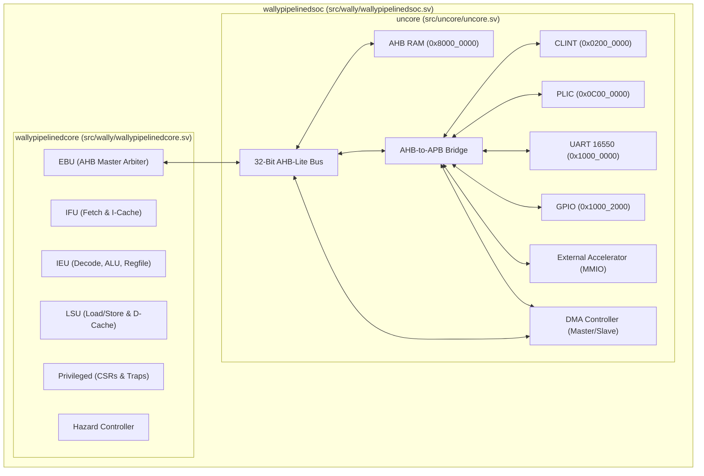
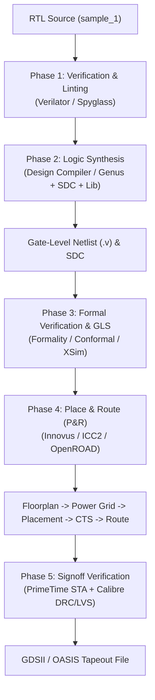

# CORE-V-Wally Minimal 32-Bit RISC-V Core & SoC
## Complete RTL Source Package & RTL-to-GDSII ASIC Implementation Guide

This directory (`sample_1`) contains the complete, self-contained SystemVerilog RTL source code for the `my_minimal_rv32` CORE-V-Wally RISC-V SoC architecture.

---

## Table of Contents
1. [Directory Contents & File Inventory](#1-directory-contents--file-inventory)
2. [Hardware Specifications (`my_minimal_rv32`)](#2-hardware-specifications-my_minimal_rv32)
3. [Architecture Overview & RTL Hierarchy](#3-architecture-overview--rtl-hierarchy)
4. [How to Attach External Peripherals & Hardware Accelerators](#4-how-to-attach-external-peripherals--hardware-accelerators)
   - [Method 1: Memory-Mapped AHB-Lite Bus Attachment (Accelerator)](#method-1-memory-mapped-ahb-lite-bus-attachment-accelerator)
   - [Method 2: APB Peripheral Bus Attachment](#method-2-apb-peripheral-bus-attachment)
   - [Method 3: Adding a General-Purpose AHB DMA Controller](#method-3-adding-a-general-purpose-ahb-dma-controller)
   - [Writing Bare-Metal Software Drivers](#writing-bare-metal-software-drivers)
5. [Complete RTL-to-GDSII ASIC Flow Guide](#5-complete-rtl-to-gdsii-asic-flow-guide)
   - [Phase 1: RTL Functional Verification & Linting](#phase-1-rtl-functional-verification--linting)
   - [Phase 2: Logic Synthesis (RTL → Gate-Level Netlist)](#phase-2-logic-synthesis-rtl--gate-level-netlist)
   - [Phase 3: Gate-Level Simulation (GLS) & Formal Verification](#phase-3-gate-level-simulation-gls--formal-verification)
   - [Phase 4: Physical Design & Place and Route (P&R → GDSII)](#phase-4-physical-design--place-and-route-pr--gdsii)
   - [Phase 5: Signoff STA, DRC/LVS, and Tapeout](#phase-5-signoff-sta-drclvs-and-tapeout)
6. [EDA Tool Commands & Quick Reference](#6-eda-tool-commands--quick-reference)

---

## 1. Directory Contents & File Inventory

```text
sample_1/
├── filelist.f            # Master synthesis/simulation filelist manifest (231 files total)
├── README.md             # Technical documentation & ASIC implementation guide
├── config/               # Top-level SystemVerilog configuration header files
│   ├── config.vh         # my_minimal_rv32 parameter configuration (XLEN=32, AHB Bus, RAM)
│   ├── config-shared.vh  # Shared RISC-V constants, mode encodings, and CSR definitions
│   ├── parameter-defs.vh # Struct definitions and helper macros
│   └── BranchPredictorType.vh # Branch predictor type encodings
└── src/                  # Complete SystemVerilog RTL source tree
    ├── cvw.sv            # Top-level package & cvw_t parameter struct definition
    ├── wally/            # Top-level SoC (wallypipelinedsoc.sv) & Core (wallypipelinedcore.sv)
    ├── uncore/           # AHB/APB bus, RAM, ROM, CLINT, PLIC, UART 16550, GPIO, SPI
    ├── ifu/              # Instruction Fetch Unit & Branch Predictor
    ├── ieu/              # Integer Execution Unit (ALU, Register File, Control)
    ├── lsu/              # Load/Store Unit & Caches
    ├── fpu/              # Floating Point Unit (Disabled in minimal config)
    ├── privileged/       # CSRs, Trap Unit, Privilege Modes (Machine/User)
    ├── hazard/           # Pipeline Stall & Flush Controller
    ├── mdu/              # Multiply/Divide Unit (Disabled in minimal config)
    ├── ebu/              # External Bus Unit (AHB Arbiter)
    ├── cache/            # Shared Cache Infrastructure (I-Cache / D-Cache)
    ├── mmu/              # Memory Management Unit & PMP/PMA Checkers
    └── generic/          # Generic SRAM/RAM/ROM Hardware Primitives
```

---

## 2. Hardware Specifications (`my_minimal_rv32`)

| Parameter | Setting | Description |
| :--- | :--- | :--- |
| **ISA Base** | `RV32I` | 32-Bit RISC-V Base Integer Instruction Set |
| **Extensions** | `Zicsr`, `Zicntr` | CSR Access & Performance Counters enabled |
| **Datapath Width** | `XLEN = 32` | 32-bit registers, 32-bit ALU, 32-bit memory addresses |
| **System Bus** | `AHB-Lite 32-Bit` | High-performance 32-bit system bus with AHB-to-APB bridge |
| **Instruction Cache** | `1 KB` | Direct-mapped I-Cache (`ICACHE_NUMWAYS = 1`) |
| **Data Cache** | `1 KB` | Direct-mapped D-Cache (`DCACHE_NUMWAYS = 1`) |
| **RAM Space** | `0x8000_0000` | 32-Bit AHB RAM module mapped at `0x8000_0000` |
| **CLINT (Timer)** | `0x0200_0000` | Core Local Interruptor (Software & Timer interrupts) |
| **PLIC (External)** | `0x0C00_0000` | Platform-Level Interrupt Controller (Peripheral interrupts) |
| **UART 16550** | `0x1000_0000` | 16550D UART with internal 16-byte FIFOs & DMA mode signals |
| **GPIO** | `0x1000_2000` | 32-bit General Purpose I/O peripheral |
| **SPI** | `0x1000_3000` | Serial Peripheral Interface controller |

---

## 3. Architecture Overview & RTL Hierarchy



---

## 4. How to Attach External Peripherals & Hardware Accelerators

### Method 1: Memory-Mapped AHB-Lite Bus Attachment (Accelerator)

An AHB-Lite slave accelerator connects directly to the 32-bit system bus for high throughput and low latency.

#### 1. Write the SystemVerilog Accelerator Module (`my_accel_ahb.sv`)

Create your accelerator inside `src/uncore/my_accel_ahb.sv`:

```systemverilog
// src/uncore/my_accel_ahb.sv
// 32-Bit AHB-Lite Hardware Accelerator

module my_accel_ahb (
    input  logic        HCLK,
    input  logic        HRESETn,
    input  logic        HSEL,
    input  logic [31:0] HADDR,
    input  logic [31:0] HWDATA,
    input  logic        HWRITE,
    input  logic [1:0]  HTRANS,
    input  logic        HREADY,
    output logic [31:0] HRDATA,
    output logic        HREADYOUT,
    output logic [1:0]  HRESP,
    output logic        accel_irq   // Interrupt to PLIC
);

    // Register Map Offsets
    // 0x00: CONTROL (Bit 0: Start, Bit 1: Reset)
    // 0x04: STATUS  (Bit 0: Done,  Bit 1: Busy)
    // 0x08: DATA_IN
    // 0x0C: RESULT

    logic [31:0] ctrl_reg, status_reg, data_in_reg, result_reg;
    logic        write_phase;
    logic [31:0] addr_phase;

    assign HREADYOUT = 1'b1;  // Zero wait-state assertion
    assign HRESP     = 2'b00; // OKAY response

    // Address and Control Phase Latch
    always_ff @(posedge HCLK or negedge HRESETn) begin
        if (!HRESETn) begin
            write_phase <= 1'b0;
            addr_phase  <= 32'h0;
        end else if (HREADY & HSEL & HTRANS[1]) begin
            write_phase <= HWRITE;
            addr_phase  <= HADDR;
        end else begin
            write_phase <= 1'b0;
        end
    end

    // Write Operations (Data Phase)
    always_ff @(posedge HCLK or negedge HRESETn) begin
        if (!HRESETn) begin
            ctrl_reg    <= 32'h0;
            data_in_reg <= 32'h0;
        end else if (write_phase) begin
            case (addr_phase[3:0])
                4'h0: ctrl_reg    <= HWDATA;
                4'h8: data_in_reg <= HWDATA;
            endcase
        end
    end

    // Computation Logic
    always_ff @(posedge HCLK or negedge HRESETn) begin
        if (!HRESETn) begin
            result_reg <= 32'h0;
            status_reg <= 32'h0;
            accel_irq  <= 1'b0;
        end else if (ctrl_reg[0]) begin // Start bit set
            result_reg <= result_reg + data_in_reg; // Custom calculation
            status_reg <= 32'h1;                    // Done flag
            accel_irq  <= 1'b1;                    // Assert PLIC interrupt
        end
    end

    // Read Operations
    always_comb begin
        case (addr_phase[3:0])
            4'h0: HRDATA = ctrl_reg;
            4'h4: HRDATA = status_reg;
            4'h8: HRDATA = data_in_reg;
            4'hC: HRDATA = result_reg;
            default: HRDATA = 32'h0;
        endcase
    end

endmodule
```

#### 2. Instantiate the Accelerator in `uncore.sv`

In [src/uncore/uncore.sv](file:///home/ganesh/Desktop/cvw/sample_1/src/uncore/uncore.sv):

1. Assign base address decode logic at `0x1000_4000`.
2. Connect `HADDR`, `HWDATA`, `HRDATA`, `HSEL`, and `accel_irq` to the PLIC module.

```systemverilog
// Inside uncore.sv
logic HSEL_ACCEL;
assign HSEL_ACCEL = (HADDR[31:12] == 20'h10004); // Address range 0x1000_4000 to 0x1000_4FFF

my_accel_ahb accel (
    .HCLK(HCLK),
    .HRESETn(HRESETn),
    .HSEL(HSEL_ACCEL),
    .HADDR(HADDR),
    .HWDATA(HWDATA),
    .HWRITE(HWRITE),
    .HTRANS(HTRANS),
    .HREADY(HREADY),
    .HRDATA(HRDATA_ACCEL),
    .HREADYOUT(HREADYOUT_ACCEL),
    .HRESP(),
    .accel_irq(accel_interrupt)
);
```

---

### Method 2: APB Peripheral Bus Attachment

For low-power, lower-speed peripherals, connect to the APB bus downstream of `ahbapbbridge.sv`.

---

### Method 3: Adding a General-Purpose AHB DMA Controller

A DMA Controller operates as a **dual-interface block**:
1. **AHB Slave Interface**: CPU programs MMIO registers (`SRC_ADDR`, `DST_ADDR`, `LENGTH`, `CONTROL`) at MMIO base `0x1000_5000`.
2. **AHB Master Interface**: DMA engine acquires bus mastership from the AHB arbiter (`ebu.sv`), autonomously reading from source memory and writing to target destination without CPU intervention.

#### 1. DMA Controller Module Interface (`my_dma_controller_ahb.sv`)

Create `src/uncore/my_dma_controller_ahb.sv`:

```systemverilog
// src/uncore/my_dma_controller_ahb.sv
// Dual-Interface AHB-Lite DMA Controller (Slave Config + Master Transfer)

module my_dma_controller_ahb (
    input  logic        HCLK,
    input  logic        HRESETn,

    // --- AHB Slave Interface (CPU Configuration at 0x1000_5000) ---
    input  logic        HSEL_S,
    input  logic [31:0] HADDR_S,
    input  logic [31:0] HWDATA_S,
    input  logic        HWRITE_S,
    input  logic [1:0]  HTRANS_S,
    input  logic        HREADY_S,
    output logic [31:0] HRDATA_S,
    output logic        HREADYOUT_S,

    // --- AHB Master Interface (Autonomous Bus Transfer) ---
    output logic        HBUSREQ_M,
    input  logic        HGRANT_M,
    output logic [31:0] HADDR_M,
    output logic [31:0] HWDATA_M,
    output logic        HWRITE_M,
    output logic [1:0]  HTRANS_M,
    input  logic [31:0] HRDATA_M,
    input  logic        HREADY_M,

    // Interrupt signal to PLIC
    output logic        dma_irq
);

    // MMIO Registers
    // 0x00: SRC_ADDR  (Source Address)
    // 0x04: DST_ADDR  (Destination Address)
    // 0x08: LEN       (Transfer Length in words)
    // 0x0C: CONTROL   (Bit 0: Start, Bit 1: Busy, Bit 2: Interrupt Enable)

    logic [31:0] src_addr_reg, dst_addr_reg, len_reg, ctrl_reg;
    logic [31:0] dma_buffer;
    typedef enum logic [1:0] {IDLE, READ_SRC, WRITE_DST, DONE} state_t;
    state_t state;

    assign HREADYOUT_S = 1'b1;

    // --- Slave Control Register Programming ---
    always_ff @(posedge HCLK or negedge HRESETn) begin
        if (!HRESETn) begin
            src_addr_reg <= 32'h0;
            dst_addr_reg <= 32'h0;
            len_reg      <= 32'h0;
            ctrl_reg     <= 32'h0;
        end else if (HSEL_S & HWRITE_S & HTRANS_S[1]) begin
            case (HADDR_S[3:0])
                4'h0: src_addr_reg <= HWDATA_S;
                4'h4: dst_addr_reg <= HWDATA_S;
                4'h8: len_reg      <= HWDATA_S;
                4'hC: ctrl_reg     <= HWDATA_S;
            endcase
        end
    end

    // --- Master FSM (Autonomous Transfer Engine) ---
    always_ff @(posedge HCLK or negedge HRESETn) begin
        if (!HRESETn) begin
            state      <= IDLE;
            HBUSREQ_M  <= 1'b0;
            HWRITE_M   <= 1'b0;
            HTRANS_M   <= 2'b00;
            dma_irq    <= 1'b0;
        end else begin
            case (state)
                IDLE: begin
                    if (ctrl_reg[0]) begin // Start bit set
                        HBUSREQ_M <= 1'b1;
                        state     <= READ_SRC;
                    end
                end

                READ_SRC: begin
                    if (HGRANT_M & HREADY_M) begin
                        HADDR_M   <= src_addr_reg;
                        HWRITE_M  <= 1'b0;
                        HTRANS_M  <= 2'b10; // NONSEQ transfer
                        dma_buffer <= HRDATA_M;
                        state     <= WRITE_DST;
                    end
                end

                WRITE_DST: begin
                    if (HREADY_M) begin
                        HADDR_M    <= dst_addr_reg;
                        HWDATA_M   <= dma_buffer;
                        HWRITE_M   <= 1'b1;
                        HTRANS_M   <= 2'b10;
                        src_addr_reg <= src_addr_reg + 4;
                        dst_addr_reg <= dst_addr_reg + 4;
                        len_reg      <= len_reg - 1;
                        if (len_reg <= 1) state <= DONE;
                        else              state <= READ_SRC;
                    end
                end

                DONE: begin
                    HBUSREQ_M <= 1'b0;
                    HTRANS_M  <= 2'b00;
                    dma_irq   <= ctrl_reg[2]; // Trigger PLIC IRQ
                    state     <= IDLE;
                end
            endcase
        end
    end

endmodule
```

---

### Writing Bare-Metal Software Drivers

In your C application (`main.c`):

```c
#define ACCEL_BASE     0x10004000
#define ACCEL_CTRL     (*(volatile unsigned int *)(ACCEL_BASE + 0x00))
#define ACCEL_STATUS   (*(volatile unsigned int *)(ACCEL_BASE + 0x04))
#define ACCEL_DATA_IN  (*(volatile unsigned int *)(ACCEL_BASE + 0x08))
#define ACCEL_RESULT   (*(volatile unsigned int *)(ACCEL_BASE + 0x0C))

#define DMA_BASE       0x10005000
#define DMA_SRC        (*(volatile unsigned int *)(DMA_BASE + 0x00))
#define DMA_DST        (*(volatile unsigned int *)(DMA_BASE + 0x04))
#define DMA_LEN        (*(volatile unsigned int *)(DMA_BASE + 0x08))
#define DMA_CTRL       (*(volatile unsigned int *)(DMA_BASE + 0x0C))

// Trigger hardware accelerator
unsigned int run_accelerator(unsigned int value) {
    ACCEL_DATA_IN = value;
    ACCEL_CTRL = 0x1;
    while ((ACCEL_STATUS & 0x1) == 0);
    return ACCEL_RESULT;
}

// Trigger autonomous DMA transfer
void dma_transfer(unsigned int src, unsigned int dst, unsigned int word_count) {
    DMA_SRC  = src;
    DMA_DST  = dst;
    DMA_LEN  = word_count;
    DMA_CTRL = 0x5; // Bit 0: Start, Bit 2: Interrupt Enable
}
```

---

## 5. Complete RTL-to-GDSII ASIC Flow Guide

Below is the industrial implementation workflow for converting `sample_1` into silicon tapeout files (`GDSII` / `OASIS`).



---

### Phase 1: RTL Functional Verification & Linting

1. **RTL Linting**:
   ```bash
   verilator --lint-only -Iconfig -Isrc -f filelist.f --top-module wallypipelinedsoc
   ```
2. **Functional Simulation**:
   ```bash
   wsim my_minimal_rv32 tests/custom/my_baremetal_test/my_test.elf --sim verilator
   ```

---

### Phase 2: Logic Synthesis (RTL → Gate-Level Netlist)

Synthesis translates SystemVerilog code into standard cell gates using process technology target libraries (`.lib`).

#### 1. Create Timing Constraints (`wally.sdc`)

Create `wally.sdc` to specify target clock period (e.g. 200 MHz = 5.0 ns period):

```tcl
# wally.sdc - Synopsys Design Constraints
create_clock -name clk -period 5.0 [get_ports clk]
set_clock_uncertainty 0.2 [get_clocks clk]
set_input_delay 1.0 -clock clk [all_inputs]
set_output_delay 1.0 -clock clk [all_outputs]
set_load 0.05 [all_outputs]
```

#### 2. Run Synthesis with Synopsys Design Compiler (`dc_shell`)

Execute the TCL synthesis script `synth.tcl`:

```tcl
# synth.tcl - Design Compiler Synthesis Script
set target_library "tsmc28nm_rvt_tt1v25c.lib"
set link_library "* tsmc28nm_rvt_tt1v25c.lib"

analyze -format sverilog -vcs "-Iconfig -Isrc" {src/cvw.sv src/wally/wallypipelinedsoc.sv}
elaborate wallypipelinedsoc
read_sdc wally.sdc

compile_ultra -gate_clock

write -format verilog -hierarchy -output wally_netlist.v
write_sdc wally_mapped.sdc
report_area > area_report.txt
report_timing > timing_report.txt
report_power > power_report.txt
```

Execution command:
```bash
dc_shell -f synth.tcl
```

---

### Phase 3: Gate-Level Simulation (GLS) & Formal Verification

1. **Equivalence Checking (Formal Verification)**:
   Mathematically verify that `wally_netlist.v` matches `sample_1`:
   ```bash
   fm_shell -f equivalence_check.tcl
   ```
2. **Gate-Level Simulation with SDF Timing**:
   Simulate the synthesized netlist with annotated gate delays:
   ```bash
   vsim -c -do "vlog wally_netlist.v; vsim -sdfmax /tb/dut=wally.sdf testbench; run -all"
   ```

---

### Phase 4: Physical Design & Place and Route (P&R → GDSII)

Physical Design maps logic gates onto physical silicon coordinates using Cadence Innovus or Synopsys ICC2.

```tcl
# innovus.tcl - Cadence Innovus Place & Route Command Sequence
# 1. Import Netlist & Technology LEF Files
importDesign -netlist wally_netlist.v -top wallypipelinedsoc -lef {tech.lef stdcells.lef}

# 2. Floorplanning & Power Mesh Generation
floorPlan -r 1.0 0.70 20 20 20 20   # 70% core utilization ratio
addRing -nets {VDD VSS} -width 2 -spacing 1 -layer {metal4 metal5}

# 3. Standard Cell Placement
place_opt_design

# 4. Clock Tree Synthesis (CTS)
ccopt_design

# 5. Signal Routing & Filler Insertion
routeDesign
addFiller -cell {FILL1 FILL2 FILL4}

# 6. Stream Out GDSII Layout File
streamOut wallypipelinedsoc.gds -mapFile gds2.map
```

---

### Phase 5: Signoff STA, DRC/LVS, and Tapeout

1. **Signoff Static Timing Analysis (STA)** with Synopsys PrimeTime:
   ```bash
   pt_shell -f primetime_sta.tcl
   ```
2. **DRC/LVS Physical Verification** with Siemens Calibre:
   ```bash
   calibre -drc -hier wally_drc.rules wallypipelinedsoc.gds
   calibre -lvs -hier wally_lvs.rules wallypipelinedsoc.gds
   ```
3. **Tapeout**: Transfer final `wallypipelinedsoc.gds` to the foundry for physical mask fabrication.

---

## 6. EDA Tool Commands & Quick Reference

| Implementation Phase | Primary EDA Tool | Command |
| :--- | :--- | :--- |
| **Lint Analysis** | Verilator | `verilator --lint-only -Iconfig -Isrc -f filelist.f` |
| **RTL Simulation** | Verilator / wsim | `wsim my_minimal_rv32 my_test.elf --sim verilator` |
| **Logic Synthesis** | Synopsys Design Compiler | `dc_shell -f synth.tcl` |
| **Formal Equivalence**| Synopsys Formality | `fm_shell -f formal.tcl` |
| **Place & Route** | Cadence Innovus | `innovus -files innovus.tcl` |
| **Signoff STA** | Synopsys PrimeTime | `pt_shell -f sta.tcl` |
| **DRC / LVS** | Siemens Calibre | `calibre -drc -hier wally.gds` |
